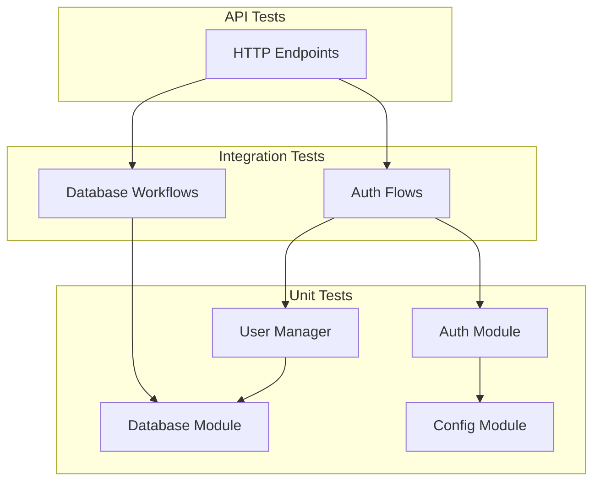

# Technical Design Document

## Overview

本设计文档��GeekGate 项目自动化测试系统的技术��方案。测试系统基�pytest 框�，采用分层测试��，覆盖�元测试�集�测试和 API 端点测试三个层次�

### 设计目标

1. **隔离�*: 使用内存 SQLite 数�库，确�测试之间相互独立
2. **�维护�*: 通过 pytest fixtures �用测试设置代�
3. **覆盖�*: 通过 pytest-cov 追踪代�覆盖�
4. **���*: 使用�性测试验�核心功能的正确�

### 技术栈

- **测试框�**: pytest 8.x
- **�性测�*: hypothesis
- **覆盖�*: pytest-cov
- **HTTP 测试**: httpx (FastAPI TestClient)
- **Mock**: unittest.mock, pytest-mock

## Architecture

```
tests/
├── conftest.py              # 全局 fixtures
├── unit/                    # �元测试
�  ├── __init__.py
�  ├── test_database.py     # 数�库模�测�
�  ├── test_user_manager.py # 用户管�模�测试
�  ├── test_auth.py         # 认�模�测试
�  └── test_config.py       # �置模�测试
├── integration/             # 集�测试
�  ├── __init__.py
�  ├── test_db_workflow.py  # 数�库工作�测试
�  └── test_auth_flow.py    # 认��程测试
└── api/                     # API 端点测试
    ├── __init__.py
    ├── test_health.py       # �康检查端点测�
    ├── test_auth_endpoints.py # 认�端点测试
    └── test_user_endpoints.py # 用户端点测试
```

### 测试分层策略



## Components and Interfaces

### 1. Test Fixtures (conftest.py)

```python
# 核心 fixtures ��

@pytest.fixture
async def test_db() -> AsyncGenerator[UserDatabase, None]:
    """�供隔离的内存数�库�例"""
    
@pytest.fixture
async def test_user(test_db) -> User:
    """�供预创建的测试用户"""
    
@pytest.fixture
async def test_api_key(test_db, test_user) -> tuple[str, APIKey]:
    """�供预创建的 API Key (返��始 key �APIKey 对象)"""

@pytest.fixture
def test_client(test_db) -> TestClient:
    """�供�置好的 FastAPI TestClient"""

@pytest.fixture
def mock_oauth_response() -> dict:
    """�供模拟�OAuth2 �应数�"""

@pytest.fixture
def mock_kiro_token_response() -> dict:
    """�供模拟�Kiro Token 刷新�应"""
```

### 2. Database Test Interface

```python
class TestUserDatabase:
    """数�库模�测试类"""
    
    async def test_create_user_returns_valid_user(self, test_db):
        """验� create_user 返�正确�User 对象"""
        
    async def test_get_user_by_id(self, test_db, test_user):
        """验�通过 ID 查询用户"""
        
    async def test_api_key_creation_and_verification(self, test_db, test_user):
        """验� API Key 创建和验���""
        
    async def test_token_encryption_roundtrip(self, test_db, test_user):
        """验� Token 加密解密 round-trip"""
```

### 3. User Manager Test Interface

```python
class TestUserSessionManager:
    """会�管�测试�""
    
    async def test_session_creation_and_verification(self, test_db):
        """验�会�创建和验�""
        
    async def test_expired_session_rejected(self, test_db):
        """验�过期会�被拒�""

class TestUserManager:
    """用户管�测试�""
    
    def test_password_hash_roundtrip(self):
        """验�密�哈希 round-trip"""
        
    async def test_email_registration_and_login(self, test_db):
        """验�邮箱注册和登录��""
```

### 4. Auth Module Test Interface

```python
class TestGeekAuthManager:
    """认�管�测试�""
    
    def test_token_expiring_soon_detection(self):
        """验� Token 过期检�""
        
    def test_auth_type_detection(self):
        """验�认�类�检�""
```

### 5. Config Module Test Interface

```python
class TestConfig:
    """�置模�测试�""
    
    def test_model_mapping(self):
        """验�模�映射"""
        
    def test_adaptive_timeout(self):
        """验�自适应超时计算"""
        
    def test_settings_validation(self):
        """验��置验�"""
```

## Data Models

### Test Data Generators (for Property-Based Testing)

```python
from hypothesis import strategies as st

# 用户数�生�策略
user_data_strategy = st.fixed_dictionaries({
    "username": st.text(min_size=1, max_size=50),
    "email": st.emails(),
    "password": st.text(min_size=8, max_size=100),
})

# Token 数�生�策略
token_strategy = st.text(min_size=10, max_size=500, alphabet=st.characters(
    whitelist_categories=('L', 'N'),
    whitelist_characters='-_'
))

# 密�生�策略
password_strategy = st.text(min_size=8, max_size=100)

# 模��称生�策略
valid_model_strategy = st.sampled_from([
    "claude-opus-4-5",
    "claude-haiku-4-5", 
    "claude-sonnet-4-5",
    "claude-sonnet-4",
])
```

### Mock Response Models

```python
@dataclass
class MockOAuthTokenResponse:
    access_token: str
    token_type: str = "Bearer"
    expires_in: int = 3600
    refresh_token: Optional[str] = None

@dataclass
class MockOAuthUserInfo:
    id: str
    username: str
    avatar_url: Optional[str] = None
    trust_level: int = 0

@dataclass
class MockKiroTokenResponse:
    accessToken: str
    refreshToken: Optional[str] = None
    expiresIn: int = 3600
    profileArn: Optional[str] = None
```

## Correctness Properties

*A property is a characteristic or behavior that should hold true across all valid executions of a system-essentially, a formal statement about what the system should do. Properties serve as the bridge between human-readable specifications and machine-verifiable correctness guarantees.*

### Property 1: User Creation Round-Trip

*For any* valid user data (username, email, password), creating a user and then querying by ID should return a User object with matching fields.

**Validates: Requirements 2.2, 6.1**

### Property 2: API Key Creation and Verification Round-Trip

*For any* user, creating an API Key and then verifying it should return the correct user ID and APIKey object.

**Validates: Requirements 2.5, 2.6, 6.2**

### Property 3: Token Encryption Round-Trip

*For any* valid token string, encrypting and then decrypting should return the original token value.

**Validates: Requirements 2.8, 2.9**

### Property 4: Password Hash Round-Trip

*For any* valid password string (8+ characters), `_verify_password(_hash_password(password), password)` should return True.

**Validates: Requirements 3.5, 3.8**

### Property 5: Session Creation and Verification Round-Trip

*For any* user with valid session version, creating a session and immediately verifying it should return the correct user ID.

**Validates: Requirements 3.1, 3.2**

### Property 6: Token Expiration Detection

*For any* token with expiration time, `is_token_expiring_soon()` should return True if and only if the time until expiration is less than TOKEN_REFRESH_THRESHOLD.

**Validates: Requirements 4.1, 4.2**

### Property 7: Auth Type Detection

*For any* GeekAuthManager configuration, the auth type should be IDC if and only if both client_id and client_secret are provided.

**Validates: Requirements 4.4, 4.5**

### Property 8: Model Mapping Consistency

*For any* valid external model name in AVAILABLE_MODELS, `get_internal_model_id()` should return a non-empty string without raising an exception.

**Validates: Requirements 5.1**

### Property 9: Adaptive Timeout Calculation

*For any* model name and base timeout, `get_adaptive_timeout()` should return `base_timeout * SLOW_MODEL_TIMEOUT_MULTIPLIER` for slow models, and `base_timeout` for other models.

**Validates: Requirements 5.3, 5.4**

### Property 10: Session Invalidation on Version Increment

*For any* user session, incrementing the session version should cause all previously created session tokens to fail verification.

**Validates: Requirements 6.6, 7.2, 7.3**

### Property 11: Banned User Login Rejection

*For any* banned user, login attempts should be rejected regardless of correct credentials.

**Validates: Requirements 7.4**

### Property 12: Concurrent User Creation Uniqueness

*For any* email address, concurrent attempts to create users with the same email should result in exactly one successful creation.

**Validates: Requirements 12.6**

## Error Handling

### 测试错误处�策略

| 错误类� | 处�方� | 测试验� |
|---------|---------|---------|
| 无效用户 ID | 返� None | test_get_user_invalid_id |
| 无效 API Key | 返� None | test_verify_api_key_invalid |
| 过期 Session | 返� None | test_expired_session |
| 无效模��| 抛出 ValueError | test_invalid_model_name |
| 无身份标�| 抛出 ValueError | test_create_user_no_identity |
| 密�过短 | 返�错误消� | test_short_password |
| 无效邮箱 | 返�错误消� | test_invalid_email |
| ��邮箱 | 返�错误消� | test_duplicate_email |

### Mock 错误场景

```python
# OAuth2 错误�应
mock_oauth_error = {
    "error": "invalid_grant",
    "error_description": "Authorization code expired"
}

# Kiro Token 刷新错误
mock_token_refresh_error = {
    "error": "invalid_token",
    "message": "Refresh token is invalid or expired"
}
```

## Testing Strategy

### ��测试方法

本测试系统采用�元测试和�性测试相结�的方法：

1. **�元测试**: 验�特定示例�边界�件和错误处�
2. **�性测�*: 验�跨所有输入的通用��

### �性测试��

- **测试�*: hypothesis
- **最�迭代次�*: 100 ���
- **标签格�**: `Feature: automated-testing, Property {number}: {property_text}`

```python
from hypothesis import given, settings

@settings(max_examples=100)
@given(password=password_strategy)
def test_password_hash_roundtrip(password):
    """
    Feature: automated-testing, Property 4: Password Hash Round-Trip
    """
    user_manager = UserManager()
    hashed = user_manager._hash_password(password)
    assert user_manager._verify_password(password, hashed)
```

### �元测试�点

- 特定示例验�正确行为
- 边界�件 (空值�无效输�
- 错误�件和异常处�
- 组件间集�点

### pytest �置 (pytest.ini)

```ini
[pytest]
testpaths = tests
python_files = test_*.py
python_classes = Test*
python_functions = test_*
asyncio_mode = auto
addopts = -v --tb=short --strict-markers
markers =
    unit: Unit tests
    integration: Integration tests
    api: API endpoint tests
    slow: Slow tests
    property: Property-based tests
```

### 覆盖���(.coveragerc)

```ini
[run]
source = geek_gateway
omit = 
    */tests/*
    */__pycache__/*
    */venv/*

[report]
exclude_lines =
    pragma: no cover
    def __repr__
    raise NotImplementedError
    if TYPE_CHECKING:

[html]
directory = htmlcov
```

### 测试执行命令

```bash
# �行所有测�
pytest

# �行�元测试
pytest tests/unit -v

# �行集�测试
pytest tests/integration -v

# �行 API 测试
pytest tests/api -v

# �行�性测�
pytest -m property -v

# 生�覆盖�报�
pytest --cov=geek_gateway --cov-report=html

# 按�称过滤测�
pytest -k "test_password" -v
```
