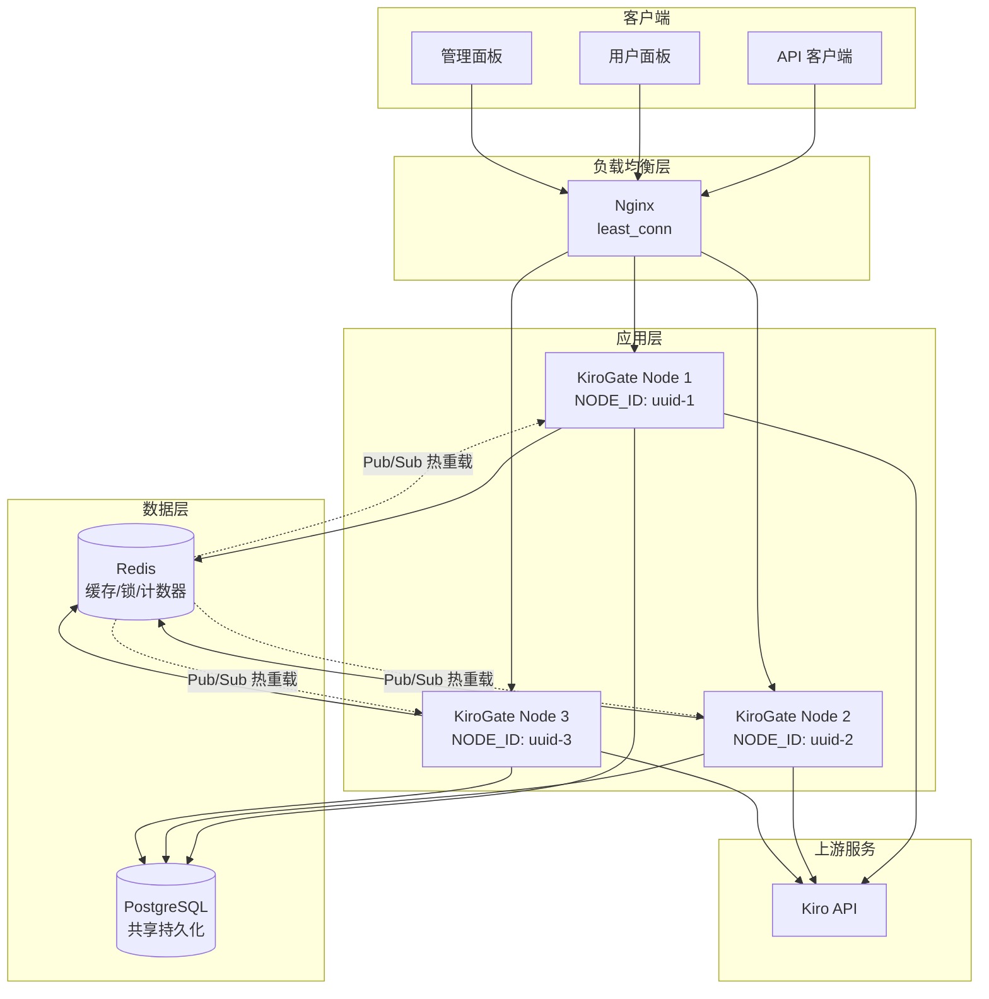
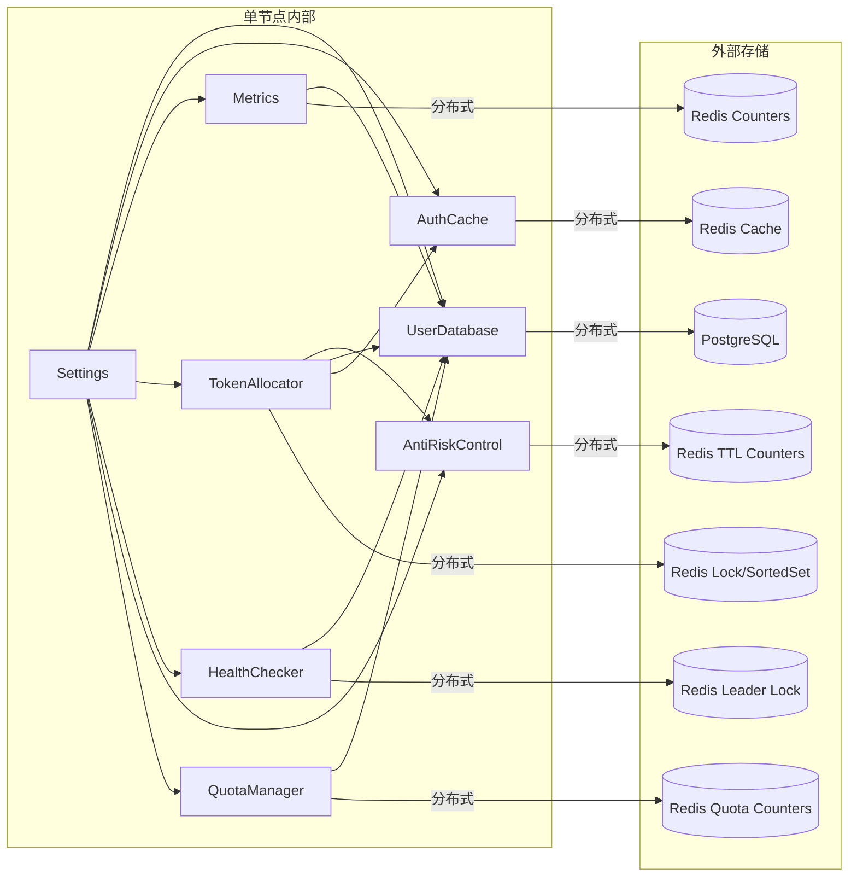
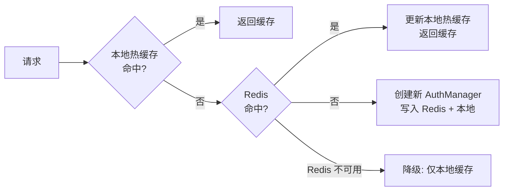
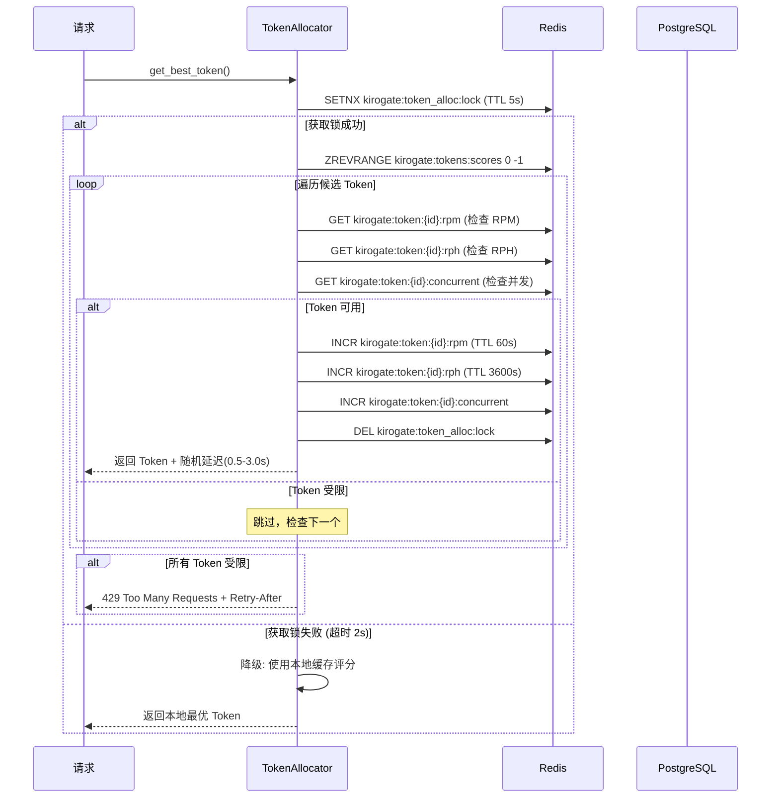
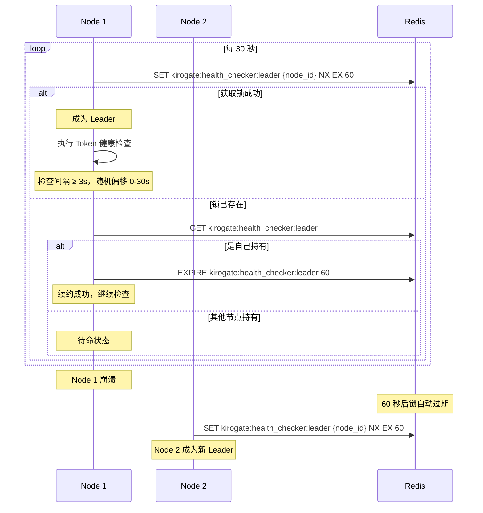
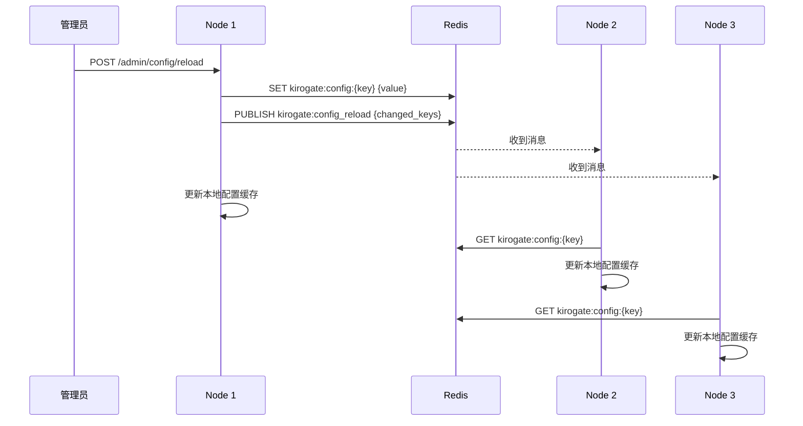

# 设计文档：KiroGate 分布式部署

## 概述

本设计将 KiroGate 从单节点 SQLite + 内存架构迁移为分布式多节点架构，使用 PostgreSQL 作为共享持久化存储、Redis 作为分布式缓存/锁/计数器。设计遵循"双模式"原则：所有模块通过 `Settings.deployment_mode` 属性自动检测部署模式，分布式模式使用 PostgreSQL + Redis，单节点模式保持 SQLite + 内存不变。

核心改造涵盖 7 个现有模块（config、database、auth_cache、metrics、token_allocator、health_checker、user_manager）和 3 个新增子系统（Token 防风控、用户端管理、管理端管理），以及 Docker 编排和 Nginx 负载均衡配置。

### 设计目标

- 支持 10 万并发在线用户的水平扩展能力
- 100% 向后兼容：不配置 PostgreSQL/Redis 时行为与升级前完全一致
- Redis 不可用时自动降级为本地实现，PostgreSQL 不可用时返回 503
- Token 防风控策略降低上游风控风险
- 完善的用户端和管理端管理功能

## 架构

### 高层架构图



### 模块交互图




## 组件与接口

### 1. 配置模块扩展（需求 1）

在现有 `Settings` 类中新增分布式部署相关配置项：

```python
# kiro_gateway/config.py - Settings 类新增字段

# 数据库配置
database_url: str = Field(
    default="sqlite:///data/kirogate.db",
    alias="DATABASE_URL"
)
db_pool_size: int = Field(default=20, alias="DB_POOL_SIZE")
db_max_overflow: int = Field(default=10, alias="DB_MAX_OVERFLOW")

# Redis 配置
redis_url: str = Field(default="", alias="REDIS_URL")
redis_max_connections: int = Field(default=50, alias="REDIS_MAX_CONNECTIONS")

# 节点标识
node_id: str = Field(
    default_factory=lambda: str(uuid.uuid4())[:8],
    alias="NODE_ID"
)

# Token 防风控配置（需求 12）
token_rpm_limit: int = Field(default=10, alias="TOKEN_RPM_LIMIT")
token_rph_limit: int = Field(default=200, alias="TOKEN_RPH_LIMIT")
token_max_concurrent: int = Field(default=2, alias="TOKEN_MAX_CONCURRENT")
token_max_consecutive_uses: int = Field(default=5, alias="TOKEN_MAX_CONSECUTIVE_USES")

# 用户配额配置（需求 13）
default_user_daily_quota: int = Field(default=500, alias="DEFAULT_USER_DAILY_QUOTA")
default_user_monthly_quota: int = Field(default=10000, alias="DEFAULT_USER_MONTHLY_QUOTA")
default_key_rpm_limit: int = Field(default=30, alias="DEFAULT_KEY_RPM_LIMIT")
```

部署模式判定属性：

```python
@property
def is_distributed(self) -> bool:
    """判断是否为分布式模式。"""
    return (
        self.database_url.startswith("postgresql")
        and bool(self.redis_url)
    )
```

分布式模式启动时的安全验证（需求 7.3）：在 `validate_security_defaults` 中增加检查，当 `is_distributed` 为 True 时，`ADMIN_SECRET_KEY` 和 `USER_SESSION_SECRET` 不得使用默认值，否则拒绝启动。

### 2. 数据库抽象层（需求 2）

#### 设计决策

当前 `UserDatabase` 直接使用 `sqlite3` 模块，约 60 个同步方法。迁移策略：

- 引入 `DatabaseBackend` 抽象接口，提供 `SQLiteBackend` 和 `PostgreSQLBackend` 两种实现
- 所有方法改为 `async`，SQLite 后端通过 `aiosqlite` 实现异步
- PostgreSQL 后端使用 `SQLAlchemy async` + `asyncpg`，通过连接池管理连接
- `UserDatabase` 作为门面类，根据配置委托给对应后端

```python
# kiro_gateway/db_backend.py

from abc import ABC, abstractmethod

class DatabaseBackend(ABC):
    """数据库后端抽象接口。"""

    @abstractmethod
    async def initialize(self) -> None: ...

    @abstractmethod
    async def close(self) -> None: ...

    @abstractmethod
    async def execute(self, query: str, params: tuple = ()) -> Any: ...

    @abstractmethod
    async def fetch_one(self, query: str, params: tuple = ()) -> Optional[dict]: ...

    @abstractmethod
    async def fetch_all(self, query: str, params: tuple = ()) -> List[dict]: ...

    @abstractmethod
    async def transaction(self) -> AsyncContextManager: ...


class SQLiteBackend(DatabaseBackend):
    """SQLite 后端，使用 aiosqlite。"""
    # 保持现有 SQLite 行为，仅包装为异步接口

class PostgreSQLBackend(DatabaseBackend):
    """PostgreSQL 后端，使用 SQLAlchemy async + asyncpg。"""
    # 连接池由 DB_POOL_SIZE 和 DB_MAX_OVERFLOW 控制
    # 使用数据库事务替代 threading.Lock
```

#### PostgreSQL Schema 适配

| SQLite | PostgreSQL |
|--------|-----------|
| `INTEGER PRIMARY KEY AUTOINCREMENT` | `SERIAL PRIMARY KEY` |
| `INTEGER` (布尔) | `BOOLEAN` |
| `INTEGER` (时间戳) | `BIGINT` |
| `TEXT` | `TEXT` |
| `REAL` | `DOUBLE PRECISION` |

#### 新增数据库表（需求 13、14）

```sql
-- 用户配额表
CREATE TABLE IF NOT EXISTS user_quotas (
    user_id INTEGER PRIMARY KEY REFERENCES users(id) ON DELETE CASCADE,
    daily_quota INTEGER NOT NULL DEFAULT 500,
    monthly_quota INTEGER NOT NULL DEFAULT 10000,
    daily_used INTEGER NOT NULL DEFAULT 0,
    monthly_used INTEGER NOT NULL DEFAULT 0,
    daily_reset_at BIGINT NOT NULL,    -- 下次日配额重置时间戳
    monthly_reset_at BIGINT NOT NULL   -- 下次月配额重置时间戳
);

-- 审计日志表（需求 14.9）
CREATE TABLE IF NOT EXISTS audit_logs (
    id SERIAL PRIMARY KEY,
    admin_username TEXT NOT NULL,
    action_type TEXT NOT NULL,         -- 'token_pause', 'user_ban', 'quota_update', 'config_reload' 等
    target_type TEXT,                  -- 'token', 'user', 'config' 等
    target_id TEXT,                    -- 目标 ID
    details TEXT,                      -- JSON 格式的操作详情
    created_at BIGINT NOT NULL
);
CREATE INDEX IF NOT EXISTS idx_audit_action ON audit_logs(action_type, created_at);

-- 用户活动日志表（需求 13.13）
CREATE TABLE IF NOT EXISTS activity_logs (
    id SERIAL PRIMARY KEY,
    user_id INTEGER NOT NULL REFERENCES users(id) ON DELETE CASCADE,
    api_key_id INTEGER,
    model TEXT NOT NULL,
    status_code INTEGER NOT NULL,
    latency_ms INTEGER NOT NULL,
    created_at BIGINT NOT NULL
);
CREATE INDEX IF NOT EXISTS idx_activity_user ON activity_logs(user_id, created_at);

-- 用户通知表（需求 13.11, 13.12）
CREATE TABLE IF NOT EXISTS user_notifications (
    id SERIAL PRIMARY KEY,
    user_id INTEGER NOT NULL REFERENCES users(id) ON DELETE CASCADE,
    type TEXT NOT NULL,                -- 'token_suspended', 'token_invalid', 'quota_warning'
    message TEXT NOT NULL,
    is_read BOOLEAN DEFAULT FALSE,
    created_at BIGINT NOT NULL
);
CREATE INDEX IF NOT EXISTS idx_notifications_user ON user_notifications(user_id, is_read);
```

#### tokens 表扩展字段

```sql
-- 为 Token 防风控新增字段
ALTER TABLE tokens ADD COLUMN consecutive_fails INTEGER DEFAULT 0;
ALTER TABLE tokens ADD COLUMN cooldown_until BIGINT DEFAULT 0;
ALTER TABLE tokens ADD COLUMN consecutive_uses INTEGER DEFAULT 0;
ALTER TABLE tokens ADD COLUMN risk_score REAL DEFAULT 0.0;
```


### 3. Redis 连接管理

引入全局 Redis 连接管
### 3. Redis 连接管理

引入全局 Redis 连接管理器，所有需要 Redis 的组件通过它获取连接：

```python
# kiro_gateway/redis_manager.py

class RedisManager:
    """Redis 连接池管理器，支持优雅降级。"""

    def __init__(self):
        self._pool: Optional[redis.asyncio.ConnectionPool] = None
        self._client: Optional[redis.asyncio.Redis] = None
        self._available: bool = False
        self._reconnect_task: Optional[asyncio.Task] = None

    async def initialize(self, redis_url: str, max_connections: int) -> None:
        """初始化 Redis 连接池。"""

    async def close(self) -> None:
        """关闭连接池。"""

    @property
    def is_available(self) -> bool:
        """Redis 是否可用。"""

    async def get_client(self) -> Optional[redis.asyncio.Redis]:
        """获取 Redis 客户端，不可用时返回 None。"""

    async def _reconnect_loop(self) -> None:
        """每 30 秒尝试重连（需求 10.4）。"""

redis_manager = RedisManager()
```

### 4. 认证缓存迁移（需求 3）

#### 双层缓存架构



`AuthManagerCache` 改造：

```python
class AuthManagerCache:
    def __init__(self, max_size: int = 100, hot_cache_size: int = 50):
        self._hot_cache: OrderedDict[str, KiroAuthManager] = OrderedDict()
        self._hot_cache_size = hot_cache_size
        self._max_size = max_size  # 单节点模式使用
        self._lock = asyncio.Lock()

    async def get_or_create(self, refresh_token, region=None, profile_arn=None):
        # 1. 查本地热缓存
        # 2. 分布式模式: 查 Redis (TTL 3600s)
        # 3. 未命中: 创建新实例，写入 Redis + 本地
        # 4. Redis 不可用: 降级为仅本地缓存
```

Redis Key 设计：
- `kirogate:auth_cache:{token_hash}` — 序列化的 AuthManager 状态，TTL 3600 秒

### 5. 指标系统迁移（需求 4）

#### Redis Key Schema

```
# 原子计数器
kirogate:metrics:total_requests          # INCR - 总请求数
kirogate:metrics:total_errors            # INCR - 总错误数
kirogate:metrics:total_retries           # INCR - 总重试数

# Hash - 分维度指标
kirogate:metrics:by_endpoint             # HINCRBY - 按端点统计
kirogate:metrics:by_status               # HINCRBY - 按状态码统计
kirogate:metrics:by_model                # HINCRBY - 按模型统计
kirogate:metrics:by_error_type           # HINCRBY - 按错误类型统计

# Sorted Set - 延迟分位数
kirogate:metrics:latency:{endpoint}      # ZADD - 延迟样本，score=时间戳

# List - 最近请求记录
kirogate:metrics:recent_requests         # LPUSH + LTRIM(100) - 最近 100 条

# Set - IP 封禁列表
kirogate:metrics:banned_ips              # SADD/SREM/SISMEMBER

# String - 全局开关
kirogate:metrics:site_enabled            # GET/SET - 站点启用状态
kirogate:metrics:self_use_enabled        # GET/SET - 自用模式
kirogate:metrics:require_approval        # GET/SET - 审批模式
kirogate:metrics:proxy_api_key           # GET/SET - 代理 API Key

# Hash - Token 使用量（带 TTL）
kirogate:metrics:tokens:input_tokens     # HINCRBY - 按模型输入 token
kirogate:metrics:tokens:output_tokens    # HINCRBY - 按模型输出 token
```

#### Pipeline 批量写入

`PrometheusMetrics` 在分布式模式下使用 Redis Pipeline 批量写入，减少网络往返：

```python
async def inc_request(self, endpoint, status_code, model="unknown"):
    if settings.is_distributed:
        pipe = redis_client.pipeline()
        pipe.incr("kirogate:metrics:total_requests")
        pipe.hincrby("kirogate:metrics:by_endpoint", endpoint, 1)
        pipe.hincrby("kirogate:metrics:by_status", str(status_code), 1)
        pipe.hincrby("kirogate:metrics:by_model", model, 1)
        await pipe.execute()
    else:
        # 保持现有内存字典实现
```

#### 降级策略（需求 4.9）

Redis 不可用时降级为本地内存计数。Redis 恢复后，通过 INCRBY 将本地累计值同步到 Redis。


### 6. 分布式 Token 分配（需求 5、12）

#### Token 评分与防风控

在现有评分算法基础上，引入风控因子：

```python
def calculate_score(self, token: DonatedToken, risk_data: dict) -> float:
    """
    计算 Token 评分 (0-100)。

    评分因子：
    - 成功率 (权重 40%)
    - 新鲜度 (权重 15%)
    - 负载均衡 (权重 15%)
    - 风控安全 (权重 30%) — 新增
    """
    # ... 现有成功率、新鲜度、负载均衡计算 ...

    # 风控安全评分 (权重 30%)
    rpm_usage = risk_data.get("rpm", 0) / settings.token_rpm_limit
    rph_usage = risk_data.get("rph", 0) / settings.token_rph_limit
    concurrent = risk_data.get("concurrent", 0) / settings.token_max_concurrent
    consecutive = risk_data.get("consecutive_uses", 0) / settings.token_max_consecutive_uses

    # 使用率越高，评分越低
    risk_penalty = max(rpm_usage, rph_usage, concurrent, consecutive)
    risk_score = max(0, 30 * (1 - risk_penalty))

    return base_score + freshness + usage_score + risk_score
```

#### Token 分配流程（分布式模式）



#### Redis Key Schema（Token 风控）

```
# Sorted Set - Token 评分
kirogate:tokens:scores                    # ZADD - member=token_id, score=评分

# 原子计数器 - RPM/RPH/并发（带 TTL）
kirogate:token:{id}:rpm                   # INCR, TTL=60s  — 每分钟请求数
kirogate:token:{id}:rph                   # INCR, TTL=3600s — 每小时请求数
kirogate:token:{id}:concurrent            # INCR/DECR — 当前并发数
kirogate:token:{id}:consecutive           # INCR, 轮换时 DEL — 连续使用次数

# Hash - Token 使用统计
kirogate:token:{id}:stats                 # HINCRBY success/fail — 跨节点计数

# String - Token 冷却
kirogate:token:{id}:cooldown              # SET, TTL=冷却时间 — 冷却标记

# 分布式锁
kirogate:token_alloc:lock                 # SETNX, TTL=5s — 分配锁
```

#### 指数退避冷却策略（需求 12.10-12.12）

```python
COOLDOWN_POLICY = {
    2: 300,     # 连续失败 2 次 → 冷却 5 分钟
    3: 1800,    # 连续失败 3 次 → 冷却 30 分钟
    5: None,    # 连续失败 5 次 → 暂停，等待手动恢复或健康检查通过
}
```

#### 请求完成后释放并发计数

请求完成（无论成功失败）后，必须通过 `DECR kirogate:token:{id}:concurrent` 释放并发计数。在中间件或 request_handler 的 finally 块中执行。

### 7. 健康检查器领导者选举（需求 6）



健康检查优化（需求 12.13-12.14）：
- 每个 Token 检查时间添加 0-30 秒随机偏移
- 相邻 Token 检查间隔至少 3 秒

### 8. 会话一致性（需求 7）

跨节点会话一致性通过以下机制保证：

1. **共享密钥**：所有节点使用相同的 `ADMIN_SECRET_KEY`、`USER_SESSION_SECRET`、`TOKEN_ENCRYPT_KEY`（通过环境变量注入）
2. **Cookie 签名验证**：`UserSessionManager` 使用 `itsdangerous.URLSafeTimedSerializer`，只要密钥相同，任意节点都能验证 cookie
3. **会话吊销**：通过 PostgreSQL 中 `users.session_version` 字段实现。管理员吊销会话时递增 `session_version`，所有节点在验证 session 时检查版本号是否匹配

无需引入 Redis session store，因为当前 session 机制是无状态的签名 cookie。

### 9. 用户配额与速率限制（需求 13）

#### Redis Key Schema（用户/API Key 速率限制）

```
# 用户配额计数器
kirogate:user:{id}:daily_count            # INCR, TTL=到当日结束 — 每日请求数
kirogate:user:{id}:monthly_count          # INCR, TTL=到当月结束 — 每月请求数

# API Key 速率限制
kirogate:apikey:{id}:rpm                  # INCR, TTL=60s — 每分钟请求数
```

#### 配额检查流程

在中间件中，请求到达时：
1. 识别用户 ID 和 API Key ID
2. 检查用户每日/每月配额（Redis 原子计数器）
3. 检查 API Key RPM 限制
4. 任一超限则返回 429，响应体包含配额重置时间

#### 用户面板数据

用户面板展示的数据来源：
- 使用统计（总请求数、成功率）：从 `activity_logs` 表聚合
- 配额使用情况：从 Redis 计数器读取（分布式）或从 `user_quotas` 表读取（单节点）
- Token 健康状态：从 `tokens` 表 + Redis 风控数据组合
- API Key 列表：从 `api_keys` 表读取
- 最近请求记录：从 `activity_logs` 表读取最近 50 条
- 通知：从 `user_notifications` 表读取未读通知


### 10. 管理端管理（需求 14）

#### 集群概览（需求 14.1）

每个节点定期（每 10 秒）向 Redis 上报心跳：

```
kirogate:node:{node_id}:heartbeat         # SET, TTL=30s — 心跳
kirogate:node:{node_id}:info              # HSET — 节点信息（连接数、最近 1 分钟请求数）
```

管理面板通过扫描 `kirogate:node:*:heartbeat` 获取在线节点列表。

#### Token 风控仪表盘（需求 14.2-14.5）

数据来源：
- Risk_Score：从 Redis `kirogate:token:{id}:stats` 实时计算
- RPM/RPH/并发：从 Redis 原子计数器读取
- 连续失败次数：从 `tokens.consecutive_fails` 字段读取
- 状态：从 `tokens.status` 字段读取

Risk_Score 计算公式：

```python
def calculate_risk_score(token_stats: dict) -> float:
    """
    计算 Token 风险评分 (0.0 - 1.0)。

    因子：
    - RPM 使用率 (权重 0.3)
    - RPH 使用率 (权重 0.3)
    - 失败率 (权重 0.2)
    - 连续失败次数 (权重 0.2)
    """
    rpm_ratio = min(1.0, stats["rpm"] / settings.token_rpm_limit)
    rph_ratio = min(1.0, stats["rph"] / settings.token_rph_limit)
    fail_ratio = stats["fail_count"] / max(1, stats["total_count"])
    consec_ratio = min(1.0, stats["consecutive_fails"] / 5)

    return 0.3 * rpm_ratio + 0.3 * rph_ratio + 0.2 * fail_ratio + 0.2 * consec_ratio
```

#### 配置热重载（需求 14.12-14.13）



可热重载的配置项存储在 Redis Hash 中：

```
kirogate:config:hot_reload                # HSET — 可热重载的配置
  token_rpm_limit
  token_rph_limit
  token_max_concurrent
  token_max_consecutive_uses
  default_user_daily_quota
  default_user_monthly_quota
  default_key_rpm_limit
  token_min_success_rate
```

每个节点启动时订阅 `kirogate:config_reload` 频道，收到消息后从 Redis 拉取最新配置并更新本地缓存。

#### 审计日志（需求 14.9-14.10）

所有管理员操作通过 `audit_logger` 工具函数记录：

```python
async def log_audit(admin_username: str, action_type: str,
                    target_type: str, target_id: str, details: dict):
    """记录审计日志到 audit_logs 表。"""
```

操作类型枚举：`token_pause`, `token_resume`, `token_batch_pause`, `user_ban`, `user_approve`, `user_batch_approve`, `quota_update`, `config_reload`, `db_migrate`

#### 数据库迁移工具（需求 14.14-14.15）

提供 `migrate_sqlite_to_pg.py` 脚本：

1. 连接源 SQLite 数据库
2. 按表顺序导出数据（users → tokens → api_keys → ...）
3. 使用 PostgreSQL COPY 批量导入
4. 迁移过程中显示进度（已迁移表/总表数，已迁移行数）
5. 任何表迁移失败时回滚整个事务，显示失败表名和错误原因

### 11. Docker 编排与负载均衡（需求 8）

#### docker-compose.distributed.yml

```yaml
services:
  postgres:
    image: postgres:16-alpine
    environment:
      POSTGRES_DB: kirogate
      POSTGRES_USER: kirogate
      POSTGRES_PASSWORD: ${PG_PASSWORD:-changeme}
    volumes:
      - pg_data:/var/lib/postgresql/data
    healthcheck:
      test: ["CMD-SHELL", "pg_isready -U kirogate"]
      interval: 10s
      timeout: 5s
      retries: 5

  redis:
    image: redis:7-alpine
    command: redis-server --appendonly yes
    volumes:
      - redis_data:/data
    depends_on:
      postgres:
        condition: service_healthy

  kirogate:
    build: .
    deploy:
      replicas: ${KIROGATE_REPLICAS:-3}
    environment:
      DATABASE_URL: postgresql+asyncpg://kirogate:${PG_PASSWORD:-changeme}@postgres:5432/kirogate
      REDIS_URL: redis://redis:6379/0
      # ... 其他共享配置
    depends_on:
      redis:
        condition: service_started
      postgres:
        condition: service_healthy

  nginx:
    image: nginx:alpine
    ports:
      - "8000:80"
    volumes:
      - ./nginx.conf:/etc/nginx/nginx.conf:ro
    depends_on:
      - kirogate

volumes:
  pg_data:
  redis_data:
```

#### nginx.conf 核心配置

```nginx
upstream kirogate {
    least_conn;
    server kirogate:8000;
}

server {
    listen 80;

    location / {
        proxy_pass http://kirogate;
        proxy_set_header Host $host;
        proxy_set_header X-Real-IP $remote_addr;
        proxy_set_header X-Forwarded-For $proxy_add_x_forwarded_for;

        # WebSocket/SSE 支持（需求 8.6）
        proxy_http_version 1.1;
        proxy_set_header Upgrade $http_upgrade;
        proxy_set_header Connection "upgrade";
        proxy_read_timeout 300s;
        proxy_buffering off;
    }

    location /health {
        proxy_pass http://kirogate;
        # 健康检查端点
    }
}
```

### 12. 应用生命周期管理（需求 11）

#### 启动顺序

```python
async def lifespan(app: FastAPI):
    # 1. 数据库连接池初始化
    await db_backend.initialize()

    # 2. Redis 连接池初始化
    if settings.is_distributed:
        await redis_manager.initialize(settings.redis_url, settings.redis_max_connections)

    # 3. 指标系统初始化
    await metrics.initialize()

    # 4. 认证缓存初始化
    await auth_cache.initialize()

    # 5. Token 分配器初始化（同步评分到 Redis）
    await token_allocator.initialize()

    # 6. 健康检查器启动（含领导者选举）
    await health_checker.start()

    # 7. 配置热重载订阅
    if settings.is_distributed:
        await config_subscriber.start()

    # 8. 节点心跳上报
    if settings.is_distributed:
        await heartbeat.start()

    # 输出启动日志（需求 10.3）
    logger.info(f"部署模式: {'分布式' if settings.is_distributed else '单节点'}")
    if settings.is_distributed:
        logger.info(f"PostgreSQL: {settings.database_url}")
        logger.info(f"Redis: {settings.redis_url}")
        logger.info(f"Node ID: {settings.node_id}")

    yield  # 应用运行中

    # 关闭顺序（反序）
    if settings.is_distributed:
        await heartbeat.stop()
        await config_subscriber.stop()
    await health_checker.stop()          # 释放领导者锁
    await token_allocator.shutdown()
    await auth_cache.close()
    await metrics.flush()                # 刷新待写入数据
    if settings.is_distributed:
        await redis_manager.close()
    await db_backend.close()
```

#### 优雅关闭（需求 11.3）

收到 SIGTERM 后，uvicorn 会等待当前请求完成。通过配置 `--timeout-graceful-shutdown 30` 设置最大等待 30 秒。关闭过程中 `/health` 返回 503（需求 11.5），Nginx 自动将该节点从负载均衡池中移除。

### 13. 依赖管理（需求 9）

在 `requirements.txt` 中新增：

```
asyncpg>=0.29.0,<1.0.0
sqlalchemy[asyncio]>=2.0.0,<3.0.0
redis[hiredis]>=5.0.0,<6.0.0
aiosqlite>=0.20.0,<1.0.0
```

`aiosqlite` 用于单节点模式下将 SQLite 操作包装为异步接口，保持 API 一致性。

### 14. 向后兼容与健康检查（需求 10）

`/health` 端点扩展：

```json
{
  "status": "healthy",
  "mode": "distributed",
  "node_id": "abc12345",
  "postgres": "connected",
  "redis": "connected",
  "uptime": 3600
}
```

单节点模式下 `postgres` 和 `redis` 字段不出现。

